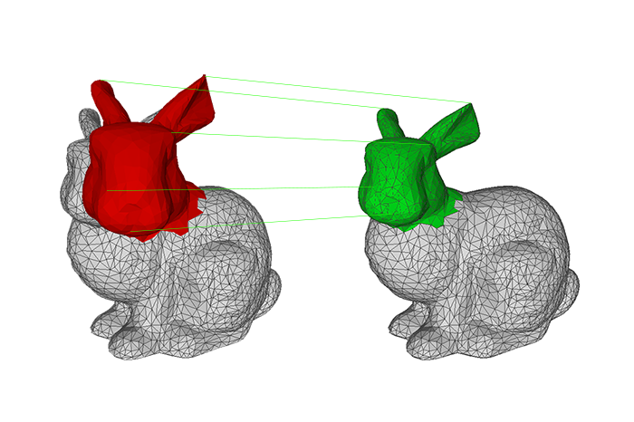

# pICP
This project provides a clean and fast implementation of the ICP method by [Besl and McKay](https://ieeexplore.ieee.org/document/121791/) in C++ with minimal dependencies (see below) and for 2D and 3D dimensions. The algorithm is one of the baseline methods on rigid alignment of point clouds, and this implementation attempts to provide an entry point for learning it with no practical hassles. At the same time, it works fast and robustly enough to be used out-of-the box on any of your projects.




## How it works
### The problem
Given two point sets:


find a rotation R and translation T that minimizes the error:


### SVD based transform estimation
Given a matrix W made by a set of correspondent N points, centered to its mean


obtain the Singular Value Decomposition of W = U * S * Vt.

Theorem without proof says that if rank( W ) = 3, the optimal solution of E( R, t ) is unique and given by:


This process can be run iteratively, selecting correspondent points by different criteria (neighbourhood, random search...), until convergence.

## Dependencies
This project attempts to use the minimal dependencies as possible, and those are self-contained in the project when possible.

* [Nanoflann](https://github.com/jlblancoc/nanoflann) for KDTree-based correspondences search. Self-contained.
* [TinyObjLoader](https://github.com/syoyo/tinyobjloader) for OBJ file parsing. Self-contained.
* [googletest](https://github.com/google/googletest) for Unit testing. Self-contained (downloads and installs automatically).
* [Eigen](http://eigen.tuxfamily.org) for matrix manipulation and SVD computation. Required on your system.
* [Boost](https://www.boost.org/) just for parsing command-line arguments into the PlainICP executable. Required on your system.

## Usage
Make sure Eigen and Boost are installed on your system and compile the full project:

```
sudo brew install eigen boost                         # For OsX
sudo apt-get install libeigen3-dev libboost-all-dev   # For Linux apt based distros

mkdir ./build
cd ./build
cmake ..
make
```

Sample call with provided sample OBJ files:

```
./PlainICP --source-obj-file ../test/data/bunny_head.obj              \
           --target-obj-file ../test/data/bunny.obj                   \
           --transformed-obj-file ../test/data/aligned_bunny_head.obj \
           --tolerance 0.005                                          \
           --verbose 1
```

If you want to integrate the ICP implementation into your project, just copy the headers into your source code. See the basic example below:

```
#include "pICP/ICP.h"

using ICP = pICP::IterativeClosestPoint< float, 3 >;

ICP icp3D;
icp3D.SetTolerance( 0.001 );

ICP::CoordinatesMatrixType sourceCoordinates(3, /* your source cloud size */);
ICP::CoordinatesMatrixType targetCoordinates(3, /* your target cloud size */);

// Populate coordinate matrices with your cloud data */

// Align
icp3D.SetSourceCoordinatesMatrix( coordinates );
icp3D.SetTargetCoordinatesMatrix( translatedCoordinates );
icp3D.Align();

// Retrieve resulting transform
icp3D.GetRotationMatrix();
icp3D.GetTranslationVector();
```

## Testing
Unit testing is provided, as a good practice and for code illustration purposes. Run the following target in the build directory:

```
make build_and_test

1: Test command: /pICP/build/test/PlainICP_test
1: Test timeout computed to be: 9.99988e+06
1: [==========] Running 16 tests from 3 test suites.
1: [----------] Global test environment set-up.
1: [----------] 9 tests from icp
1: [ RUN      ] icp.data_unavailable
1: [       OK ] icp.data_unavailable (0 ms)
1: [ RUN      ] icp.transform_not_computed
1: [       OK ] icp.transform_not_computed (0 ms)
1: [ RUN      ] icp.registration_2d_identity
1: [       OK ] icp.registration_2d_identity (1 ms)
1: [ RUN      ] icp.registration_2d_random_translation
1: [       OK ] icp.registration_2d_random_translation (9 ms)
1: [ RUN      ] icp.registration_2d_random_rotation
1: [       OK ] icp.registration_2d_random_rotation (0 ms)
1: [ RUN      ] icp.registration_2d_random_transform
1: [       OK ] icp.registration_2d_random_transform (1 ms)
1: [ RUN      ] icp.registration_3d_identity
1: [       OK ] icp.registration_3d_identity (0 ms)
1: [ RUN      ] icp.registration_3d_random_transform
1: [       OK ] icp.registration_3d_random_transform (5 ms)
1: [ RUN      ] icp.registration_3d_random_transform_and_noise
1: [       OK ] icp.registration_3d_random_transform_and_noise (204 ms)
1: [----------] 9 tests from icp (220 ms total)
1: 
1: [----------] 2 tests from pointcloud
1: [ RUN      ] pointcloud.cloud_2d
1: [       OK ] pointcloud.cloud_2d (0 ms)
1: [ RUN      ] pointcloud.cloud_3d
1: [       OK ] pointcloud.cloud_3d (0 ms)
1: [----------] 2 tests from pointcloud (0 ms total)
1: 
1: [----------] 5 tests from utils
1: [ RUN      ] utils.translate_2d
1: [       OK ] utils.translate_2d (0 ms)
1: [ RUN      ] utils.rotate_2d
1: [       OK ] utils.rotate_2d (0 ms)
1: [ RUN      ] utils.transform_3d
1: [       OK ] utils.transform_3d (0 ms)
1: [ RUN      ] utils.coordinatesDifferenceNorm_equality
1: [       OK ] utils.coordinatesDifferenceNorm_equality (0 ms)
1: [ RUN      ] utils.coordinatesDifferenceNorm_inequality
1: [       OK ] utils.coordinatesDifferenceNorm_inequality (0 ms)
1: [----------] 5 tests from utils (0 ms total)
1: 
1: [----------] Global test environment tear-down
1: [==========] 16 tests from 3 test suites ran. (220 ms total)
1: [  PASSED  ] 16 tests.
1/1 Test #1: PlainICP_test ....................   Passed    0.22 sec

```

## License
This software release is primarily [MIT](https://opensource.org/licenses/MIT) licensed. Some files contain third-party code under other license.