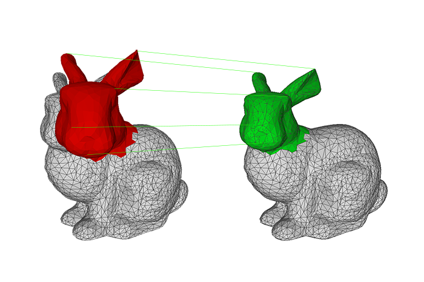

# pICP
This project provides a clean and fast implementation of the ICP method by [Besl and McKay](https://ieeexplore.ieee.org/document/121791/) in C++ with minimal dependencies ([Eigen](http://eigen.tuxfamily.org) for matrix manipulation and SVD computation, and [Nanoflann](https://github.com/jlblancoc/nanoflann) for KDTree-based correspondences search). The algorithm is one of the baseline methods on rigid alignment of point clouds, and this implementation attempts to provide an entry point for learning it with no practical hassles. At the same time, it works fast and robustly enough to be used out-of-the box on any of your projects.




## How it works
### The problem
Given two point sets:


find a rotation R and translation T that minimizes the error:


### SVD based transform estimation
Given a matrix W made by a set of correspondent N points, centered to its mean


obtain the Singular Value Decomposition of W = U * S * Vt.

Theorem without proof says that if rank( W ) = 3, the optimal solution of E( R, t ) is unique and given by:


This process can be run iteratively, selecting correspondent points by different criteria (neighbourhood, random search...), until convergence.

## Dependencies
[Eigen](http://eigen.tuxfamily.org) is the only external dependency required on your system. [Nanoflann](https://github.com/jlblancoc/nanoflann) is included in the project.

A real test executable is provided, allowing to register any desired pair of point clouds (only .obj format supported at the moment). The PointCloud class uses [TinyObjLoader](https://github.com/syoyo/tinyobjloader) (header included) for parsing OBJ files, and the PlainICP executable requires [Boost](https://www.boost.org/) for parsing external arguments.

## Usage
Just include the ICP class header on your project.

Check the provided cmake project for compiling an executable which shows how to use the class:

```
mkdir ./build
cd ./build
cmake ..
make
```

Sample call with provided sample OBJ files:

```
./PlainICP  --source-obj-file ../samples/bunny_head.obj --target-obj-file ../samples/bunny.obj --transformed-obj-file ../samples/aligned_bunny_head.obj --tolerance 0.0005 --verbose 1
```

## Testing
Unit testing using [googletest](https://github.com/google/googletest) is provided (Google Test dependency is automatically installed and self-contained within the project). Run the following target in the build directory:

```
make build_and_test
```

## License
This software release is primarily [MIT](https://opensource.org/licenses/MIT) licensed. Some files contain third-party code under other licens